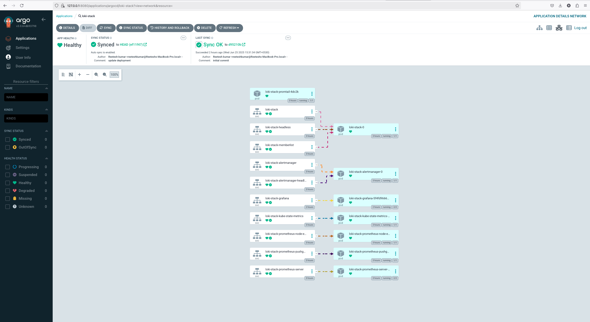

## 📘Loki Stack GitOps on Minikube


# 🚀 Loki Stack GitOps Deployment (Minikube + Argo CD)

This repo demonstrates a complete GitOps setup to deploy the **Loki logging stack** (Loki + Promtail + Grafana + Prometheus) using **Argo CD** on **Minikube**.

---

## 🗂️ Repo Structure

loki-argo/
├── charts/loki-stack/          # Vendored Helm chart
├── values.yaml                 # Custom values for Loki stack
├── loki-stack-app.yaml         # Argo CD Application for Loki stack
├── nginx/                      # Sample additional app (NGINX)
│     └── deployment.yaml
├── nginx-app.yaml              # Argo CD Application for NGINX


---

## ✅ What’s Deployed

| Component    | Description                       |
|--------------|-----------------------------------|
| Loki         | Log aggregation and storage       |
| Promtail     | Log collector (sidecar/DaemonSet) |
| Grafana      | Dashboards for logs + metrics     |
| Prometheus   | Metrics collection                 |
| Argo CD      | GitOps controller (pre-installed) |
| NGINX (demo) | Sample GitOps-managed deployment  |

---

## 🚀 Prerequisites

- [x] [Minikube](https://minikube.sigs.k8s.io/)
- [x] [kubectl](https://kubernetes.io/docs/tasks/tools/)
- [x] [Helm](https://helm.sh/)
- [x] [Argo CD](https://argo-cd.readthedocs.io/) installed in cluster
- [x] Git clone of this repo

---

## 🛠️ Setup Instructions

### 1. Start Minikube

```bash
minikube start --cpus 4 --memory 6g
````

---

### 2. Install Argo CD

```bash
kubectl create namespace argocd

kubectl apply -n argocd -f https://raw.githubusercontent.com/argoproj/argo-cd/stable/manifests/install.yaml

# Expose Argo CD UI
kubectl port-forward svc/argocd-server -n argocd 8080:443
```

Login with:

```bash
# Get admin password
kubectl -n argocd get secret argocd-initial-admin-secret \
  -o jsonpath="{.data.password}" | base64 -d
```

Access: [https://localhost:8080](https://localhost:8080)

---

### 3. Deploy Loki Stack using Argo CD

```bash
kubectl apply -f loki-stack-app.yaml
```

Argo CD will:

* Fetch the vendored Helm chart
* Apply your `values.yaml`
* Sync the full Loki stack to the `observability` namespace

---

### 4. (Optional) Deploy NGINX with GitOps

```bash
kubectl apply -f nginx-app.yaml
```

This demonstrates how to manage any app (not just Helm charts) via GitOps.

---

### 5. Verify Everything

```bash
kubectl get all -n observability
```

You should see:

* `loki`, `promtail`, `grafana`, `prometheus`, and `nginx` running
* Grafana exposed (optional: use port-forward or ingress)

---

## 🔐 Default Access

* **Grafana**:

  * Username: `admin`
  * Password: `newadmin123` (set in values)

---

## 📦 Customization

* Edit `values.yaml` to change storage backends, scrape configs, dashboards, etc.
* Add new apps (like `nginx/`) and corresponding Argo CD Application files.
* Use `ApplicationSet` for multi-env or multi-cluster deployments.

---

## 🧠 GitOps Benefits

* 🔄 All config in Git
* ♻️ Auto sync via Argo CD
* 📦 Helm chart versioning
* 🔍 Audit-friendly

---

## 📸 Screenshot (Loki Stack in Argo CD)



---

## 📜 License

MIT — free to use, modify, and share.

---

## 🙌 Credits

* [Grafana Loki](https://grafana.com/oss/loki/)
* [Argo CD](https://argo-cd.readthedocs.io/)
* [Prometheus](https://prometheus.io/)
* [Minikube](https://minikube.sigs.k8s.io/)


-----
-----
